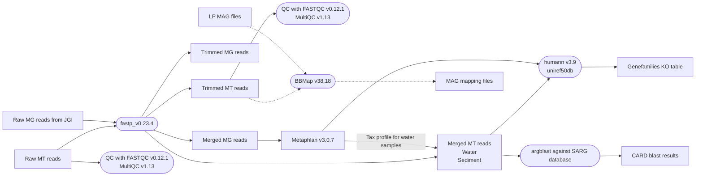

# LP transcriptomics workflow

```mermaid
flowchart LR
    node1[Raw MT reads]-->node5([fastp_v0.23.4])
    node1-->node3([QC with FASTQC v0.12.1
    MultiQC v1.13])
    node5-->node2[Trimmed MT reads]
    node2-->node4([QC with FASTQC v0.12.1
    MultiQC v1.13])
    node5-->node6[Merged MT reads
    Water
    Sediment]
    node6-->node7([humann v3.9
    uniref50db])
    node8[Raw MG reads from JGI]-->node5
    node5-->node9[Trimmed MG reads]
    node5-->node10[Merged MG reads]
    node10-->node11[Metaphlan v3.0.7]
    node11--Tax profile for water samples-->node6
    node11-->node7
    node7-->node12[Genefamilies KO table]
    node6-->node13([argblast against SARG database])
    node13-->node14[CARD blast results]
    node15[LP MAG files]
    node2-.->node16([BBMap v38.18])
    node15-.->node16-.->node17[MAG mapping files]
```